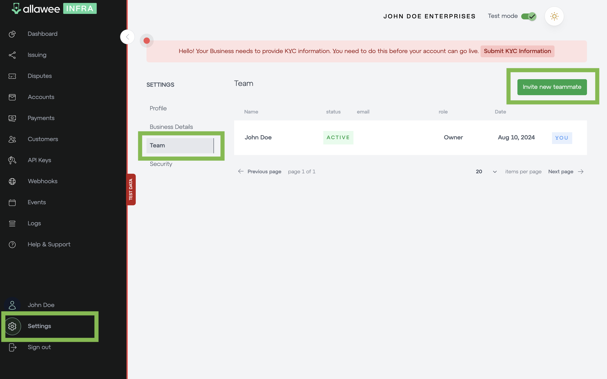

# Add a team member

You can add a team member through your settings > team, and then inviting a new teammate. You need to set a role of admin or developer for a team member. Admins have greater permissions, such as issuing cards, creating bank accounts, and creating API keys. However, developers have much more limited permissions.

