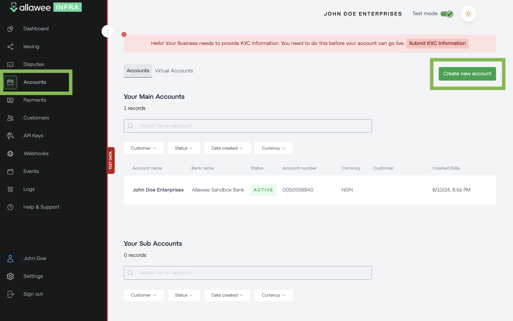

# Create a bank account

You can create a bank account from “Accounts”. The types of accounts are main, sub, and virtual. You can only have one main account, which is your business’s main bank account. You can create sub accounts for management ease. You can assign virtual accounts to your customers. However, you need to first create the customer in the “Customers” section.

