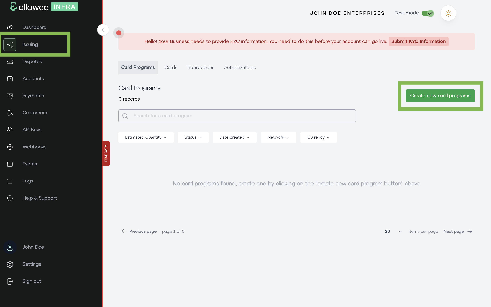

# Issue a card

You can issue a card from your dashboard through the issuing section. You need to Create a new card program, which will bring up the prompts to create your card.

You should create a customer in the “Customers” section first to assign a card to that customer.

